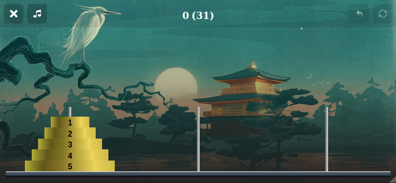

# The puzzle

Here's a screenshot from the \[Tower of Hanoi app\]\(https://towerofhanoi.app\) that shows the start position of the 3peg, 5 disc variation of the game.

The aim is to move the discs from the start peg to the destination peg \(in this case the one on the right\)  using the spare peg in the middle. Large discs cannot be placed ontop of smaller discs, and you may only move one disc at a time.

The puzzle was invented by the French mathematician [Édouard Lucas](https://en.wikipedia.org/wiki/%C3%89douard_Lucas) in 1883. 

Interesting mathematics

Unsolved problems

Games with more than 

